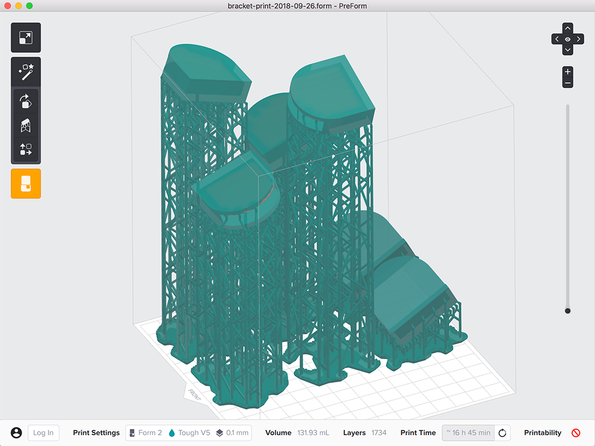

# A supported laptop stand

This repo contains the files you'd need to fabricate this laptop stand, an angled surface held up by Formlabs support lattices. If you just want to make one that's identical to mine, you only need the AI/EPS file for laser cutting and the FORM file for printing on your Form 2. If you want to modify the stand, you can do so by starting with the CAD file and generating your own 3D printing and laser files.

  
  

This model was printed in [Tough resin](https://formlabs.com/materials/engineering/#tough-overview) on a [Form 2](https://formlabs.com/3d-printers/form-2/) located at [Autodesk's Pier 9](https://www.autodesk.com/pier-9), where I'm a resident interested in, among other things, ways that 3D printing can be used alongside other fabrication processes.

#### FORM file
* `legs.form` Open directly in [PreForm](https://formlabs.com/tools/preform/) and send straight to your Form 2. It's already got the supports you'll need to print in [Tough resin](https://formlabs.com/materials/engineering/#tough-overview). You'll get a printability warning for unsupported geometries; this design has some unsupported overhangs that are 19&deg; off horizontal, [the limit](https://formlabs.com/media/upload/formlabs-design-guide.pdf) of what's recommended by Formlabs, as well as a little bit of edge geometry that's not completely supported. Some inner edges don't come out completely sharp, but they're invisible once the stand is assembled, and that's an acceptable tradeoff in this case in order to avoid needing to remove supports from the cavities inside the brackets.

  
  

#### Laser files
These were generated using [Slicer](https://apps.autodesk.com/FUSION/en/Detail/Index?id=8699194120463301363) and assume you're cutting 1/8"-thick, 24" x 36" plywood boards. I cut mine on an Epilog laser, which interprets 0.001" lines in Illustrator files as vector cuts. You may need to reconfigure line widths for your combination of software and laser.
* `laser-plans.ai` Illustrator file laid out for cutting from 1/8"-thick, 24" x 36" plywood
* `laser-plans.eps` EPS file for use in other vector-graphics software

  
  

#### CAD files
Open one of these in your favorite solid modeling software (I used Fusion 360). You can also get to the file directly through Fusion 360 here: https://a360.co/2pNZZCA
* `CAD-model.f3d` Fusion 360 archive file
* `CAD-model.step` For other solid modeling software

  
  

